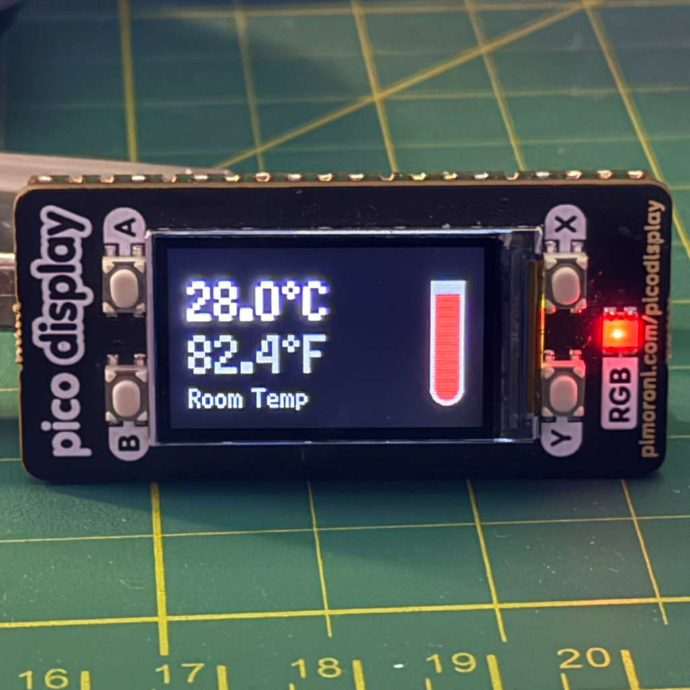

# Pico Smart Display: Thermometer, Weather & Crypto Ticker

This project started as a simple way to repurpose a Raspberry Pi Pico that I had on hand. My apartment thermostat is very old and doesn't have a display, so I wanted a convenient way to always know the temperature in my room. From there, it evolved into a multi-functional smart display that now provides weather information and real-time cryptocurrency prices, all on a vibrant Pimoroni Pico Display.

-----

## Features

  * **Live Room Thermometer:** The default screen shows the current room temperature in both Celsius and Fahrenheit, with a dynamic graphical thermometer.
  * **Live Weather Data:** Get the current "feels like" temperature for a preset location (Boston, MA).
  * **6-Hour Weather Forecast:** See the current conditions and the forecast for the next two 3-hour intervals.
  * **Cryptocurrency Tickers:** Instantly check the current USD price for Ethereum (ETH) and Solana (SOL).
  * **Wi-Fi Connected:** The device connects to your Wi-Fi at startup to fetch live data from public APIs.
  * **Modular Code:** The project is split into multiple files (`main.py`, `a.py`, `b.py`, etc.) to keep the code clean and easy to understand.

-----

## How It Works

The device boots up into the **Room Thermometer** mode. You can then use the four buttons (A, B, X, Y) to access different information screens.

### Main View: Room Thermometer

This is the default view. It uses the Pico's onboard temperature sensor to display the ambient room temperature. The thermometer graphic fills up and changes color from cool blue to hot red as the temperature rises.

### Button A: Outside Temperature

Pressing the **'A' button** fetches and displays the current weather conditions for Boston.

### Button B: Ethereum Price

Pressing the **'B' button** fetches the latest price for Ethereum in USD from the CoinGecko API.

### Button X: Weather Forecast

Pressing the **'X' button** shows the current weather conditions, plus the forecast for the next 3 and 6 hours.

### Button Y: Solana Price

Pressing the **'Y' button** fetches the latest price for Solana in USD from the CoinGecko API.

-----

## Hardware Requirements

  * **Raspberry Pi Pico W** (or a Pico with a Wi-Fi module)
  * **Pimoroni Pico Display Pack**
  * **Micro USB Cable** for power and programming

-----

## Software & Setup

This project runs on the Pimoroni-flavored MicroPython.

### 1\. Install MicroPython

  * Download the latest `.uf2` file from the [Pimoroni Pico MicroPython Releases](https://github.com/pimoroni/pimoroni-pico/releases) page.
  * Hold down the **BOOTSEL** button on your Pico while plugging it into your computer. It will appear as a drive called **RPI-RP2**.
  * Drag and drop the downloaded `.uf2` file onto the drive. The Pico will automatically restart.

### 2\. Set Up Project Files

Using an editor like [Thonny](https://thonny.org/), connect to your Pico and create the following files.

  * **`secrets.py`**: This file is required to store your Wi-Fi credentials. It should contain:

  